## ✅ RCA Example

```mermaid
sequenceDiagram
    autonumber
    participant ECS as ECS Scheduler/Fargate
    participant CTR as Container
    participant GF as GlassFish
    participant AD as Autodeploy
    participant XML as Servlet 2.5 web.xml

    Note over ECS: Morning SOD and evening EOD scheduled restarts

    ECS->>CTR: Start / restart task
    CTR->>GF: Start GlassFish
    GF->>AD: Autodeploy EAR/WAR

    rect rgb(60, 30, 30)
        Note over AD,XML: Before fix
        AD->>XML: Read web.xml
        AD->>AD: Scan classes and 37 JARs for servlet web metadata
        Note over AD: Mar 24 to Mar 28 restart time increased from about 10 min to 40+ min
        AD-->>GF: Autodeploy failed on Mar 30 to Mar 31
        GF-->>CTR: App did not deploy
        CTR-->>ECS: Restart / deployment impacted
    end

    ECS->>CTR: Restart after web.xml update
    CTR->>GF: Start GlassFish
    GF->>AD: Autodeploy EAR/WAR

    rect rgb(30, 60, 40)
        Note over AD,XML: After fix
        AD->>XML: Read web.xml with metadata-complete=true
        AD->>AD: Skip servlet annotation scanning
        AD-->>GF: Autodeploy succeeds
        GF-->>CTR: App deploys successfully
        CTR-->>ECS: Restart healthy in about 10 to 12 min
    end
```

**Explanation:** Because this is a Servlet 2.5 application that already uses `web.xml`, adding `metadata-complete="true"` allowed GlassFish to skip servlet annotation scanning during autodeploy, which restored normal restart behavior in ECS Fargate.
